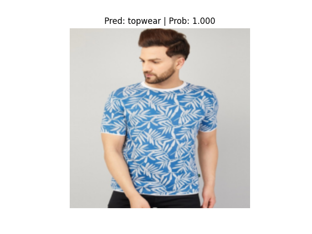
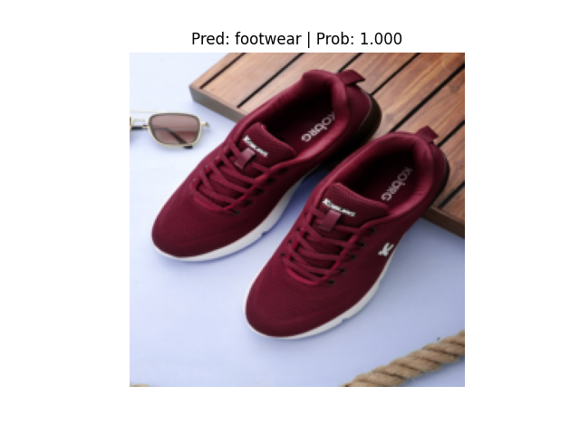
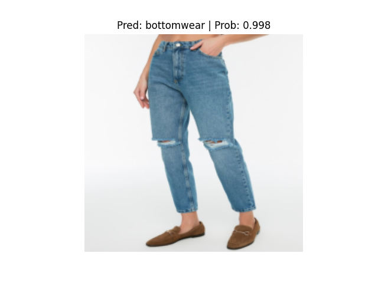
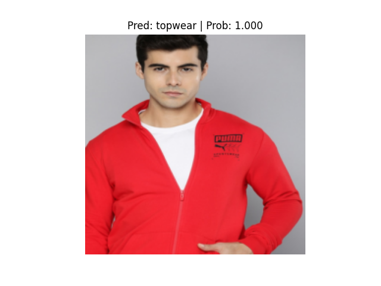
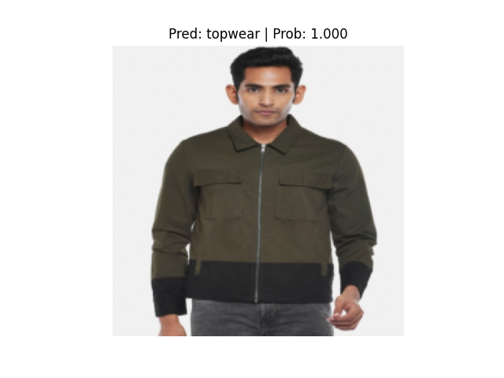

# Docker-Training-Pytorch

## Table Of Contents
  1. [Why Docker?](#why-docker)
  2. [Key Terms In Docker](#key-terms-in-docker)
  3. [Docker In MLOps](#docker-in-mlops)
  4. [Multi-Container Applications with Docker-compose : Pytorch+cpu Image classification](#multi-container-applications-with-docker-compose---pytorchcpu-image-classification)
  5. [Build Container](#build-container)
        1. [Run Train Service](#run-training-service)
        2. [Run Evaluate service](#run-evaluate-service)
        3. [Run Inference service](#run-inference-service)
  6. [Results](#results)
  7. [References](#references)

  

## Why Docker?
- Every Software Engineer or Machine Learning Engineer faced the problem **"It worked in My system, but it's not working in your"**.
- Docker solve this problem by bundling application and depedencies  into container. 
- You can use same container anywhere and it make sure that code and dependencies are consistent across environment.

## Key terms in Docker

1. **Dockerfile**
- File that contains instruction to build Docker Image. 
- It specifies base Image, environment variable to use in running container, commands, build instruction, depedencies, commands need to set up application code in running container.
- each line is  a layer which will be build, cached, which facilates reproducible builds,faster build.

2. **Image**
- A read-only template used to create docker container. IT is list of instructions to assemble image layer by layer.
- Images can be shared and distributed and reused. Dockerhub is place where shared and distributed image can be accessed.
- It is stored in docker registry.

3. **Container**
- Runnable instances of Docker images
- A Docker container image is a lightweight, standalone, executable package of software that includes everything needed to run an application: code, runtime, system tools, system libraries and settings.


4. **Volume**
- Data storage mechanism used to share data between a Docker container and the host machine, or to share data between two running container.

5. **Network**
- provide network capabilities to communicate between container or external resources.

6. **Docker Compose**
- Docker compose is a tool to manage multi-container docker application.
- uses YAML file to configure various application services.
- it provides a way to segregate different serices running on isolated environment on single host
- preserved volume when containers are created
- Only recreate container that have changed

7. **Docker Compose workflow**
- Docker compose follows below three steps
    A. **Define app's environment using Dockerfile** this helps to create docker image of application
    B. **Define services which requires by app in docker-compose file** this file specifies all the services that application requires to function, such as a database, volume, queues, caches, etc.
    C. **Run docker-compose up and Compose starts and run entire app** this will do magic and starts whole application, If images are not built, it will built new image, it uses dockerfile to build,It then recreate containers.


## Docker in MLOps
- In Machine Learning we can package ML Models, along with dependencies and ML run time environment into container.
- This facilates seemless deployment of ML models in various platform, without worrying about infrastrcture.
- In MLOps docker is very important in scaling Machine Learning models.
- Encapsulating ML Model and run time enviroment in containers will ensure automating deployment, maintain version controls, and reproducibility.

## Multi-Container Applications with Docker-compose :  Pytorch+cpu Image classification 

- Train Image classification Model using Pytorch, we will use cpu only version of pytorch and use multiprocessing cpu training ([mnist-example](https://github.com/pytorch/examples/tree/main/mnist_hogwild))
- Train model on cloth dataset which contains 5 classes
    1. bottomwear
    2. eyewear
    3. footwear
    4. handbag
    5. topwear
- Using Docker-compose to create 3 services
    1. `Train service` for training model
    2. `Evaluate service` to evaluate trained model
    3. `Infernce service` to test the trained model.
- Each service has its own Dockerfile to build container.
- shared volume is used to share data and model across container and synchronization purpose.


docker-compose.yml

```yaml
services:
    train:
        build:
            context: .
            dockerfile: Dockerfile.train
        shm_size: "2gb"
        volumes:
          - ./model:/opt/mount/model
          - ./data:/opt/mount/data
          - docker_vol:/opt/mount

    eval:
        build:
            context: .
            dockerfile: Dockerfile.eval
        volumes:
          - ./model:/opt/mount/model
          - ./data:/opt/mount/data
          - docker_vol:/opt/mount
    infer:
        build:
            context: .
            dockerfile: Dockerfile.infer
        volumes:
          - docker_vol:/opt/mount
          - ./model:/opt/mount/model
          - ./data:/opt/mount/data
          - ./responses:/opt/mount/responses
volumes:
  docker_vol:
```

Dockerfile.train
```Dockerfile
FROM python:3.9.19-slim AS stg1

    
COPY requirements.txt .

RUN apt-get update -y && apt install -y --no-install-recommends git\
&& pip install --no-cache-dir -U pip \ 
    && pip install --user --no-cache-dir https://download.pytorch.org/whl/cpu/torch-1.11.0%2Bcpu-cp39-cp39-linux_x86_64.whl \
    && pip install --user --no-cache-dir https://download.pytorch.org/whl/cpu/torchvision-0.12.0%2Bcpu-cp39-cp39-linux_x86_64.whl \
    && pip install --user --no-cache-dir -r requirements.txt && rm -rf /root/.cache/pip

# Stage 2: run application code
FROM python:3.9.19-slim

COPY --from=stg1 /root/.local /root/.local
ENV PATH=/root/.local/bin:$PATH

WORKDIR  /opt/mount/
COPY . .

#ENTRYPOINT ["/bin/bash"]
CMD ["python3", "train.py"]

```

Dockerfile.eval
```Dockerfile
FROM python:3.9.19-slim AS stg1

    
COPY requirements.txt .

RUN apt-get update -y && apt install -y --no-install-recommends git\
&& pip install --no-cache-dir -U pip \ 
    && pip install --user --no-cache-dir https://download.pytorch.org/whl/cpu/torch-1.11.0%2Bcpu-cp39-cp39-linux_x86_64.whl \
    && pip install --user --no-cache-dir https://download.pytorch.org/whl/cpu/torchvision-0.12.0%2Bcpu-cp39-cp39-linux_x86_64.whl \
    && pip install --user --no-cache-dir -r requirements.txt && rm -rf /root/.cache/pip

# Stage 2: run application code
FROM python:3.9.19-slim

COPY --from=stg1 /root/.local /root/.local
ENV PATH=/root/.local/bin:$PATH

WORKDIR  /opt/mount/
COPY . .

CMD ["python3", "eval.py"]

```

Dockerfile.infer
```Dockerfile
FROM python:3.9.19-slim AS stg1

    
COPY requirements.txt .

RUN apt-get update -y && apt install -y --no-install-recommends git\
&& pip install --no-cache-dir -U pip \ 
    && pip install --user --no-cache-dir https://download.pytorch.org/whl/cpu/torch-1.11.0%2Bcpu-cp39-cp39-linux_x86_64.whl \
    && pip install --user --no-cache-dir https://download.pytorch.org/whl/cpu/torchvision-0.12.0%2Bcpu-cp39-cp39-linux_x86_64.whl \
    && pip install --user --no-cache-dir -r requirements.txt && rm -rf /root/.cache/pip

# Stage 2: run application code
FROM python:3.9.19-slim

COPY --from=stg1 /root/.local /root/.local
ENV PATH=/root/.local/bin:$PATH

WORKDIR /opt/mount

COPY . .

ENTRYPOINT ["python3", "infer.py"]

```

## Build Container
```sh
# this command will look into docker-compose.yml file;
#For each of the service it looks for dockerfile defined in build section and build the image
# `--no-cache` flag will make sure docker will not use cache while building image.

docker compose build --no-cache 
```

## Run Training Service
- train service look for `checkpoint path` in `volume`, if it founds checkpoint file, then it will `load trained model` and `resume training`; and then save updated model in checkpoint location.
- exit
```sh
docker compose run train
```

## Run Evaluate Service
- load model from `checkpoint location`, run evaluate and store evaluation metrics in json file.
- exit
```sh
docker compose run eval
```

## Run Inference Service
- load model from `checkpoint location`.
- run infernce on random 5 images, save the results (images with file name, predicted class and predicted probability)
- exit
```sh
docker compose run infer
```

- After running all the services, we can see model and results in volume.

sample testing results (logs)
```log
✅  Train Run Successfully. ✅ 
class_names ['bottomwear', 'eyewear', 'footwear', 'handbag', 'topwear']
Checkpoint found loading from checkpoint
PID 1  Validation Loss 1.0127081871032715  Validation acc 0.8125
++++++++++++++++++++++++++++++++++++++++++++++++++
PID 1  Validation Loss 15.888932093977928  Validation acc 9.0625
++++++++++++++++++++++++++++++++++++++++++++++++++
PID 1  Validation Loss 31.48503577709198  Validation acc 17.1875
++++++++++++++++++++++++++++++++++++++++++++++++++
epoch 0 PID 1  Validation Loss 1.5017421083016829  Validation acc 0.8236742424242425
1.5017421083016829 0.8236742424242425
{'test_loss': 1.5017421083016829, 'test_acc': 0.8236742424242425}
✅  Evaluation Run Successfully. ✅ 
Checkpoint found loading from checkpoint
Model loaded from checkpoints
Inference completed. Results saved in the 'results' folder.
✅ Inference  finished  Successfully. ✅  
🔍 Checking for checkpoint file...
✅ Checkpoint file found.
🔍 Checking for eval_results.json file...
✅ eval_results.json file found.
📄 Printing the content of eval_results.json file...
{"test_loss": 1.5770455646243962, "test_acc": 0.8178030303030304}🔍 Checking for inference results...
✅ 5 inference result images found.

```

## Results

 









## References
- [docker-compose](https://docs.docker.com/compose/compose-application-model/)
- [pytorch-mnist-hogwild](https://github.com/pytorch/examples/blob/main/mnist_hogwild/main.py)
